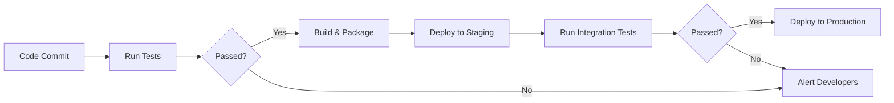

# Employee Management System 🌟🏢

<div align="center">

[](https://dotnet.microsoft.com/)
[](https://reactjs.org/)
[](https://github.com/Learnathon-By-Geeky-Solutions/dev-4545/actions)
[](https://sonarcloud.io/summary/new_code?id=Learnathon-By-Geeky-Solutions_dev-4545)
[](https://sonarcloud.io/summary/new_code?id=Learnathon-By-Geeky-Solutions_dev-4545)
[](https://tasktracker-learnathon.netlify.app/)

</div>

## 📖 Table of Contents
- [🚀 Features](#-features)
- [👥 Team](#-team)
- [🛠 Tech Stack](#-tech-stack)
- [⚙️ Installation](#️-installation)
- [📄 Configuration](#-configuration)
- [🗄 Database Setup](#-database-setup)
- [📊 Diagrams](#-diagrams)
- [🚀 CI/CD Pipeline](#-cicd-pipeline)
- [📞 Contact](#-contact)

---

## 🚀 Features
- **Role-Based Access Control** 👨💼👩💻
- **Task Management System** ✅📅
- **Leave Application Workflow** 🏖️📩
- **Real-time Caching with Redis** ⚡🔴
- **Salary Management System** 💰📈
- **Comprehensive Reporting** 📊📑

---

## 👥 Team & Mentorship

### Team Members
| Role          | Name                  | GitHub Profile                                      |
|---------------|-----------------------|----------------------------------------------------|
| Team Leader   | Nazmus Sakib          | [](https://github.com/arghya-n) |
| Developer     | Md. Mubasshir Naib    | [](https://github.com/MubasshirNaib) |
| Developer     | Saikat Hossain Shohag | [](https://github.com/shohag1102) |

### Mentor
| Role          | Name            | GitHub Profile                                      |
|---------------|-----------------|----------------------------------------------------|
| Mentor        | Sakib Mahmood   | [](https://github.com/sakibmahmood98) |

---

## 🛠 Tech Stack
### Backend


### Frontend


**UI Template Courtesy:**  
Professional dashboard template provided by [Vivasoft](https://vivasoftltd.com/)

### DevOps


---

## ⚙️ Installation

### Backend Setup
```bash
# Clone repository
git clone https://github.com/Learnathon-By-Geeky-Solutions/dev-4545.git
cd dev-4545/Employee.API

# Restore dependencies
dotnet restore

# Configure database (update connection string in appsettings.json)
dotnet ef database update --project Employee.Infrastructure

# Run the API
dotnet run
```

### Frontend Setup
```bash
cd frontend/EmpUI

# Install dependencies
npm install

# Start development server
npm run dev
```

---

## 📄 Configuration
Update `appsettings.json` with your environment values:

```json
{
  "ConnectionStrings": {
    "DefaultConnection": "Server=.;Database=EmployeeDB;Trusted_Connection=True;",
    "RedisURL": "localhost:6379"
  },
  "Jwt": {
    "Key": "your_super_secure_key_here",
    "Issuer": "EmployeeAPI",
    "Audience": "EmployeeClient"
  },
  "Cors": {
    "url": "http://localhost:3000" // React frontend URL
  }
}
```

---

## 🗄 Database Setup
 
[View ER Diagram](https://github.com/Learnathon-By-Geeky-Solutions/dev-4545/blob/doc/er-diagram.pdf)

---

## 📊 Diagrams
| Diagram Type          | Link                                                                                   |
|-----------------------|---------------------------------------------------------------------------------------|
| **UML Diagram**       | [View UML Diagram](https://github.com/Learnathon-By-Geeky-Solutions/dev-4545/blob/doc/Employee%20Management%20UML.pdf) |
| **Activity Diagram**  | [View Activity Diagram](https://github.com/Learnathon-By-Geeky-Solutions/dev-4545/blob/doc/Activity%20Diagram.pdf)     |

---

## 🚀 CI/CD Pipeline




---

## 📞 Contact

| Team Member            | Email Address                          | GitHub Profile                                                      |
|------------------------|----------------------------------------|---------------------------------------------------------------------|
| **Nazmus Sakib**       | 📧 [sakib.hb7@gmail.com]()             | 🐙 [arghya-n](https://github.com/arghya-n)                          |
| **Mubasshir Naib**     | 📧 [u1904089@student.cuet.ac.bd]()     | 🐙 [MubasshirNaib](https://github.com/MubasshirNaib)                |
| **Saikat Hossain Shohag** | 📧 [u1904088@student.cuet.ac.bd]() | 🐙 [shohag1102](https://github.com/shohag1102)                      |

[](https://github.com/Learnathon-By-Geeky-Solutions/dev-4545/issues)

---

<div align="center">
  <h3>🚀 Powered by Geeky Solutions Learnathon 2024 🚀</h3>
  
</div>